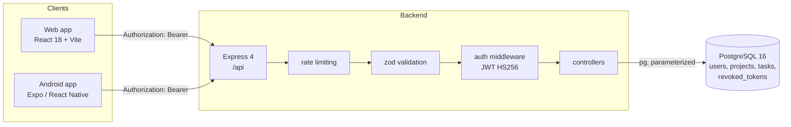

# PROSHU - Project Management System

PROSHU is a comprehensive project and task management system featuring a web application, an Android app, and a unified shared backend. This architecture ensures a seamless experience, allowing users to access and manage the same data across multiple platforms effortlessly.

```text
web (React + Vite)  ─┐
                     ├─►  backend (Express, /api)  ──►  PostgreSQL
mobile (Expo)       ─┘
```

## Contents

- [Features](#features)
- [Architecture](#architecture)
- [Tech Stack](#tech-stack)
- [Prerequisites](#prerequisites)
- [Setup](#setup)
  - [1. Database](#1-database)
  - [2. Backend](#2-backend)
  - [3. Web](#3-web)
  - [4. Mobile](#4-mobile)
- [Environment Variables](#environment-variables)
- [Testing](#testing)
- [Docker Deployment](#docker-deployment)
- [Mobile Deployment](#mobile-deployment)
- [Security Posture](#security-posture)
- [Project Structure](#project-structure)

## Features

### Accounts
- **Unified Authentication:** Register and log in seamlessly with the same account across both web and Android platforms.
- **Robust Password Policies:** Password rules are strictly enforced at three levels: instantly on the client, definitively via `zod` on the server, and safely in the database.
- **Secure Logout:** Logging out effectively invalidates the authentication token server-side.

### Projects
- **Complete Project Lifecycle:** Full CRUD capabilities including status tracking (`Not Started`, `In Progress`, `Completed`), customizable start/end dates, and comprehensive descriptions.
- **Advanced Filtering & Search:** Search projects by name (optimized with a 300ms debounce), filter by status, and sort by creation date, name, or deadlines with full pagination support.
- **Progress Tracking:** Automatic calculation of `taskCount` and `completedTaskCount` to drive real-time visual progress bars.

### Tasks
- **Task Management:** Full CRUD operations within projects. Customize task priority (`Low`, `Medium`, `High`), status (`Pending`, `In Progress`, `Completed`), and due dates.
- **Optimized UI Updates:** Instant, optimistic UI updates when ticking checkboxes or modifying task states for a highly responsive feel.
- **Advanced Querying:** Search, filter, and sort tasks across all projects with robust pagination.
- **Flexibility:** Easily move tasks between owned projects.

### Dashboard
- **Analytics Overview:** Six key metrics tracking total projects, total tasks, completed/pending ratios, active projects, and overdue items.
- **Visual Insights:** SVG-based donut charts visualizing task status breakdowns and quick access to recent projects.

### Web Client
- **Dynamic Theming:** Seamless light and dark modes that sync with OS preferences.
- **Responsive Layout:** A fluid, mobile-first design featuring a collapsible sidebar on desktop and a slide-in drawer on mobile devices.
- **Exceptional UX:** Skeleton loaders, empty states, error recovery, toast notifications, confirm dialogs, and full keyboard accessibility.

### Mobile Client
- **Intuitive Navigation:** Bottom tab navigation paired with stack screens for deep-linking into project details and forms.
- **Native Interactions:** Pull-to-refresh lists, tap-to-edit interactions, long-press deletions, and inline status toggles.
- **Offline Capabilities:** Secure token storage in the Android Keystore, offline status banners, and persistent memory caching for offline task viewing.

## Architecture



Both clients integrate seamlessly with the same centralized API endpoints, ensuring a unified data source of truth.

## Tech Stack

| Layer | Technology |
| --- | --- |
| **Backend** | Node.js 20+, Express 4, CommonJS, `pg` |
| **Database** | PostgreSQL 14+ |
| **Validation** | `zod` (request body, query, and params) |
| **Authentication**| JWT (HS256) via `Authorization: Bearer`, `bcryptjs` |
| **Security** | `helmet`, `cors` allow-listing, `express-rate-limit` |
| **Logging** | `winston` + `morgan` |
| **Web Client** | React 18, Vite 5, React Router 6, Vanilla CSS, `lucide-react` |
| **Mobile Client** | Expo SDK 57, React Navigation 7, `expo-secure-store`, NetInfo |
| **Testing** | Node's native test runner + `supertest` against a live test DB |

## Prerequisites

- Node.js 20+ (`node -v`)
- npm 10+
- PostgreSQL 14+ (or Docker)
- *For Mobile:* Expo Go app on a physical device, or an Android emulator.

## Setup

Clone the repository and install dependencies for each module independently.

### 1. Database

Choose the deployment method that suits your environment. The goal is to obtain a `DATABASE_URL` connection string for `backend/.env`.

**Option A - Docker (Recommended)**
```bash
docker run --name proshu-db -e POSTGRES_PASSWORD=postgres -e POSTGRES_DB=proshu \
  -p 5432:5432 -d postgres:16-alpine

docker exec -it proshu-db createdb -U postgres proshu_test
```

**Option B - Local PostgreSQL**
```bash
createdb proshu
createdb proshu_test
```

**Option C - Hosted (Neon / Supabase)**
Create a project via your provider's dashboard and retrieve the connection string (ensure `?sslmode=require` is appended).

Initialize the schema (idempotent):
```bash
cd backend
npm install
npm run migrate
```

### 2. Backend

```bash
cd backend
cp .env.example .env
# Edit .env: Set DATABASE_URL and JWT_SECRET
npm run migrate
npm run seed      # Generates demo data
npm run dev       # Starts dev server on http://localhost:4000
```

Verify connectivity:
```bash
curl http://localhost:4000/health
```

### 3. Web

```bash
cd web
npm install
cp .env.example .env      # VITE_API_URL=http://localhost:4000/api
npm run dev               # Starts web client on http://localhost:5173
```
*Note: Ensure `CORS_ORIGINS` in `backend/.env` includes `http://localhost:5173` and `http://127.0.0.1:5173`.*

### 4. Mobile

```bash
cd mobile
npm install
cp .env.example .env      # Set EXPO_PUBLIC_API_URL
npm start                 # Press "a" to run on Android, or scan QR with Expo Go
```

**Troubleshooting Mobile API Connections:**
- Use `http://10.0.2.2:4000/api` for Android emulators.
- Use your machine's local IP (e.g., `http://192.168.1.X:4000/api`) for physical devices on the same Wi-Fi.

## Environment Variables

### Backend (`backend/.env`)
| Name | Required | Default | Description |
| --- | --- | --- | --- |
| `DATABASE_URL` | **Yes** | - | PostgreSQL connection string |
| `JWT_SECRET` | **Yes** | - | Cryptographic signing key |
| `CORS_ORIGINS` | No | `http://localhost:5173,http://127.0.0.1:5173` | Allowed origins |
| `PORT` | No | `4000` | HTTP port |

### Web (`web/.env`)
| Name | Required | Default | Description |
| --- | --- | --- | --- |
| `VITE_API_URL` | No | `http://127.0.0.1:4000/api` | API Base URL |

## Testing

PROSHU employs an integration-first testing strategy utilizing `supertest` against a real PostgreSQL instance.

```bash
cd backend
npm run migrate   # Ensure schema is applied to TEST_DATABASE_URL
npm test
```
The suite comprehensively covers registration edge cases, authentication middleware, robust CRUD operations, cross-account data isolation, rate limiting, and SQL injection protections.

## Docker Deployment

Deploy the entire stack seamlessly via Docker Compose:
```bash
docker compose up --build
```
- **DB:** `localhost:5432`
- **Backend:** `http://localhost:4000`
- **Web:** `http://localhost:5173`

## Security Posture

PROSHU was engineered with a security-first mindset:
- **Zero-Knowledge Passwords:** Bcrypt hashed (cost 12), explicitly excluded from database `SELECT` queries to prevent accidental leakage.
- **Anti-Enumeration:** Standardized error codes mask whether an account exists or if credentials failed.
- **Stateless & Secure JWT:** Token validation enforced via `revoked_tokens` blocklisting for true server-side session termination.
- **Strict Authorization:** Resources strictly filter by `owner_id`. Unauthorized access returns a `404` to mask resource existence.
- **SQL Injection Prevention:** 100% parameterized queries. Dynamic `UPDATE` fields are strictly whitelisted.
- **Rate Limiting:** Granular throttling on authentication endpoints and general API traffic.

## Project Structure

```text
proshu/
├── backend/
│   ├── db/schema.sql              # Database schema definition
│   ├── src/                       # Application logic, middleware, and controllers
│   └── tests/                     # Integration test suites
├── web/
│   └── src/                       # React components, hooks, pages, and API clients
├── mobile/
│   └── src/                       # React Native screens, navigation, and theme
├── docs/                          # Architecture documentation and ER diagrams
├── docker-compose.yml
└── .github/workflows/ci.yml
```
