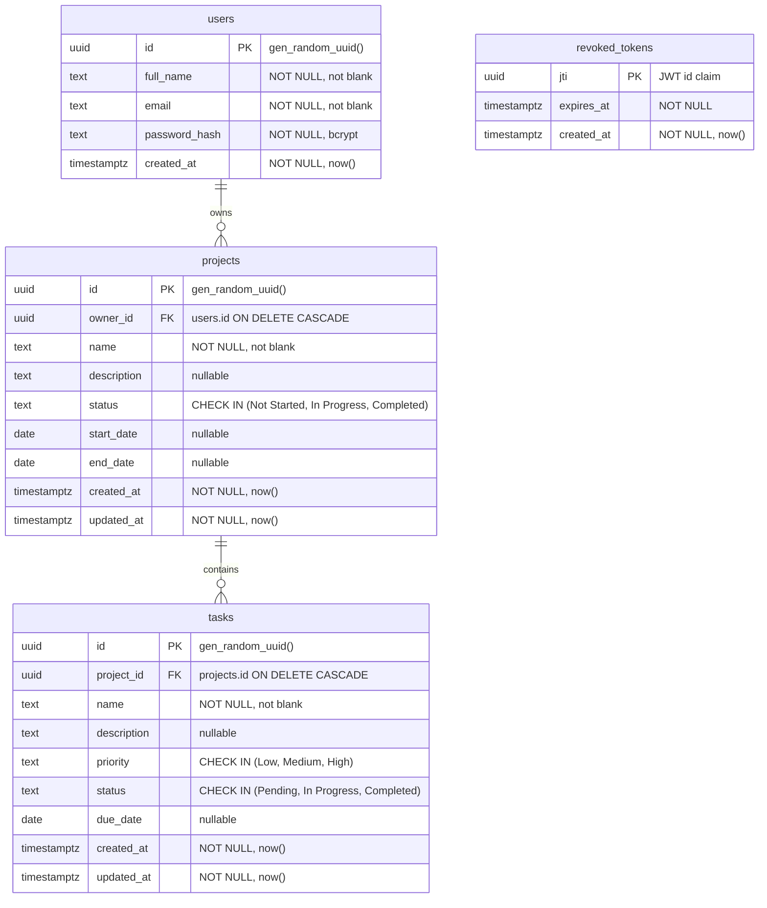

# Database design

PostgreSQL 14 or newer. The schema is defined in [`backend/db/schema.sql`](../backend/db/schema.sql)
and applied with `npm run migrate`. Every statement uses `IF NOT EXISTS`, so running it repeatedly is
safe and no migration tool is needed.

## ER diagram



`revoked_tokens` has no relationship to the other tables on purpose. It is a lookup list keyed by a
claim, not a record about a user or a project, and it holds nothing but a `jti` and an expiry.

## Tables

### users

One row per account. Deliberately has no `updated_at`: nothing in the product edits a profile yet,
and a column that is never written is a lie about the schema.

`email` is stored lowercased by the API. Uniqueness is enforced on `lower(email)`, not on `email`
itself, so `Ada@Example.com` and `ada@example.com` cannot both register.

### projects

The ownership boundary. Every authorization check in the API is either `projects.owner_id = $user`
or a join through it. Deleting a user removes their projects, and deleting a project removes its
tasks.

`status` is constrained to exactly three values with a `CHECK`, not a Postgres enum type. An enum
needs an `ALTER TYPE` to change and cannot be reordered; a `CHECK` is one line in `schema.sql` and
it keeps the API's zod enum and the database in the same vocabulary.

`end_date >= start_date` is a table-level `CHECK` that tolerates either date being `NULL`, so a
project with only a start date is valid.

### tasks

No `owner_id`. Adding one would duplicate `projects.owner_id` and let the two drift apart: rename it
in one place and the authorization decision changes depending on which column a query reads. The
cost is a join, which `tasks(project_id)` already serves.

`priority` and `status` use the same `CHECK` approach as projects.

### revoked_tokens

A signed JWT is valid until it expires, and that is the whole point of not hitting the database to
verify it. Logout needs to break that promise early, so the token's `jti` is recorded with the
token's own `expires_at`. The auth middleware looks the `jti` up on every request:

```sql
SELECT 1 FROM revoked_tokens WHERE jti = $1
```

Rows stop being useful once `expires_at` passes, which is what the index on that column is for. A
scheduled `DELETE FROM revoked_tokens WHERE expires_at < now()` is the intended cleanup, and is
listed as a known limitation in the README because nothing runs it yet.

## Constraints

| Constraint | Table | Rule |
| --- | --- | --- |
| `users_full_name_not_blank` | users | `btrim(full_name) <> ''` |
| `users_email_not_blank` | users | `btrim(email) <> ''` |
| `projects_name_not_blank` | projects | `btrim(name) <> ''` |
| `projects_status_check` | projects | status in the three allowed values |
| `projects_date_order_check` | projects | `end_date >= start_date` unless one is `NULL` |
| `tasks_name_not_blank` | tasks | `btrim(name) <> ''` |
| `tasks_priority_check` | tasks | priority in the three allowed values |
| `tasks_status_check` | tasks | status in the three allowed values |

The `NOT NULL`s are implied by the column definitions above.

The "not blank" checks exist because zod trims and rejects empty strings, and the database should
agree with the API rather than relying on it. They are the second line of defence: `""` and `"   "`
both violate them, which stops a bug in the validator from writing a nameless project.

## Indexes

| Index | Table | Columns | Serves |
| --- | --- | --- | --- |
| `users_email_lower_key` (unique) | users | `lower(email)` | Login lookup, duplicate-email detection, registration race |
| `projects_pkey` | projects | `id` | Every lookup by id |
| `projects_owner_id_idx` | projects | `owner_id` | Listing a user's projects |
| `projects_owner_status_idx` | projects | `owner_id, status` | The status filter on the project list |
| `tasks_pkey` | tasks | `id` | Every lookup by id |
| `tasks_project_id_idx` | tasks | `project_id` | Listing a project's tasks; also serves the FK cascade |
| `tasks_project_status_idx` | tasks | `project_id, status` | The status filter on a project's task list |
| `revoked_tokens_pkey` | revoked_tokens | `jti` | The auth middleware's revocation check |
| `revoked_tokens_expires_at_idx` | revoked_tokens | `expires_at` | The future cleanup query |

Two notes on why these and not more:

- **`projects_owner_status_idx` is selective on the second column only after `owner_id`.** With one
  owner that is fine: the index narrows to that owner's rows first, which is already a small set.
  It would be the wrong index if projects were ever shared between many users.
- **The FK on `tasks.project_id` gets an index for free** in the sense that `tasks_project_id_idx`
  already covers it, which matters because Postgres does not create indexes on referencing columns
  automatically and a cascading delete would otherwise scan the whole table.

## Date handling

`start_date`, `end_date` and `due_date` are `DATE`, not `TIMESTAMP`. A due date is a calendar day,
not an instant, and storing an instant invites timezone bugs.

`pg` converts a `DATE` into a JavaScript `Date` at local midnight by default. Serializing that in a
non-UTC timezone moves the calendar day backwards or forwards, which is exactly how a task due on the
16th shows up as the 15th. `backend/src/config/db.js` registers a type parser for OID 1082 that
returns the raw string, so the API speaks `YYYY-MM-DD` from the database to the browser and back.

Created and updated timestamps stay `TIMESTAMPTZ`, because those *are* instants.

## Idempotency

`backend/db/schema.sql` creates every object with `IF NOT EXISTS`, so `npm run migrate` is safe to
run on every deploy. That was a deliberate trade for a project this size: a real migration tool with
up/down steps is the right answer once a table has to be altered in place, and it is not needed while
the schema only ever grows.
